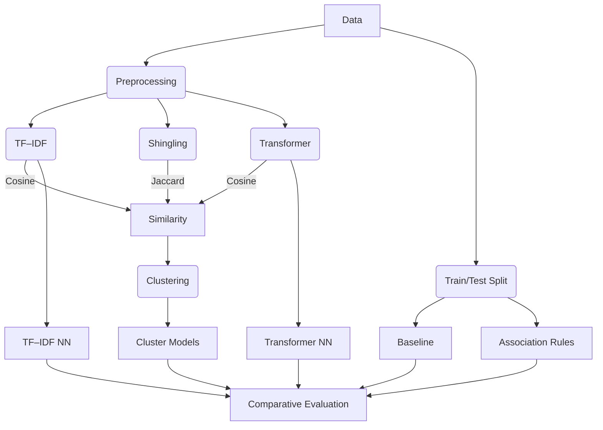

```mermaid
flowchart TD

A[Data]

A --> C(Preprocessing)

C --> D(TF–IDF)
C --> E(Shingling)
C --> F(Transformer)

D -->|Cosine| G[Similarity]
E -->|Jaccard| G
F -->|Cosine| G

G --> H(Clustering)

A --> I(Train/Test Split)

I --> J[Baseline]
I --> K[Association Rules]

H --> L[Cluster Models]
D --> M[TF–IDF NN]
F --> N[Transformer NN]

J --> O[Comparative Evaluation]
K --> O
L --> O
M --> O
N --> O

```